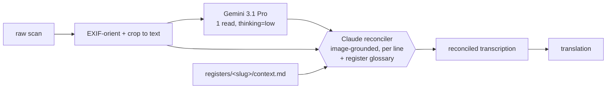

# Archivio Diocesano — HTR & Translation Pipeline

> Transcribing (and eventually translating) a photographed early-modern diocesan archive —
> Latin and Italian parish registers and episcopal/visitation decrees, **c. 1566–1691**,
> from the Pieve d'Appiano (Como/Milan) — by reading each page with a frontier vision-LLM
> and reconciling that read against the original image.

Early-modern clerical cursive is hard. This project's production approach is a **single frontier
vision-LLM read per page (Gemini 3.1 Pro) reconciled against the pixels by a second LLM (Claude)**.
The reconciler reads the *image alongside* the candidate transcription, fixes misread names and
numbers using cross-page knowledge, and marks honest uncertainty rather than guessing — grounding
in the image is what stops hallucination.

> **How we got here:** we first built the "obvious" pipeline — a panel of local HTR engines
> (McCATMuS, TRIDIS on Kraken) ensembled per line. On this material (2 MP phone photos of hard
> cursive) those engines hit **~40–60% CER** and mangled exactly the proper names that matter.
> A frontier vision-LLM reading the *whole page* with register context beat them decisively, so the
> local ensemble was **benched** (its tooling lives in [`scripts/_archive/`](scripts/_archive/)).
> Disagreement is still the signal — now it's *reader vs. image* and *read vs. cross-page context*.

---

## The archive

359 photographs across seven registers → **383 pages** after splitting open-book spreads:

| Register (slug) | Images | Date | Language | Notes |
|---|---:|---|---|---|
| Stato delle anime di Turate (`turate`) | 24 | 1679 | Italian | *status animarum*; **12 MP** scans |
| X 4 (`x-4-1574`) | 109 | 1574 | Italian/Latin | visitation/benefice volume; ~2 MP |
| X 18 (`x-18-1570-79`) | 95 | 1570–79 | Italian/Latin | visitations + 1604/1691 censuses; ~2 MP |
| X 44 (`x-44-1583`) | 65 | 1583 | Latin | 1583 visitation; ~2 MP |
| X 20 (`x-20-1583`) | 33 | 1583 | Italian/Latin | ~2 MP |
| X 5 (`x-5-1642-74`) | 28 | 1642–74 | Latin | episcopal/synodal decrees |
| X 51 (`x-51`) | 5 | — | — | undated |

> Source scans are **not committed** (size + rights); the pipeline reads them from `raw/`.

---

## Why a frontier-LLM reader + image-grounded reconciliation

A 2025 study on abbreviated Latin court hand ([arXiv:2507.04132](https://arxiv.org/abs/2507.04132))
showed that feeding an HTR read **plus the original image** to an LLM for multimodal post-correction
reaches **2–7% WER** — far better than any single engine. Here the vision-LLM *is* the reader (it
sees the page directly), and a second LLM reconciles against the same image:



**Two findings shaped this:**
- **`thinking=low` beats `high`** for transcription (A/B tested): equal accuracy, *better calibrated*
  (high is overconfident), and ~5× cheaper. The reconciler — not the reader's thinking budget — is the
  quality gate. See [`HANDOVER.md`](HANDOVER.md) §2.
- **Local HTR engines are benched** for this 2 MP material; revive only for the 12 MP Turate scans.

---

## Pipeline

1. **Manifest** — index every image (register, resolution, checksum) → `dataset/manifest.csv`.
2. **Preprocess** — EXIF-orient + crop each frame to its written area, splitting open-book spreads
   → `processed/cropped/<slug>/<pid>.jpg` and `dataset/pages.csv`.
3. **Read** — one Gemini-3.1-Pro read per page (`thinking=low`) → `candidates/<pid>.s1.json`.
4. **Reconcile** — Claude merges the read against the cropped image + the register glossary, line by
   line, fixing names/numbers and marking uncertainty → `reconciled/<pid>.txt` (the deliverable).
5. **Deduplicate** — on the *transcribed text*, not the image (perceptual hashing false-merged
   visually similar register pages).
6. **Translate** — render the final transcription into the target language (later phase).

The reader+reconcile loop runs unattended on an hourly cron; see [`pipeline/`](pipeline/) and
[`pipeline/VERIFY_LOOP.md`](pipeline/VERIFY_LOOP.md).

### Preprocessing notes (the non-obvious parts)

- **EXIF orientation** — 135 of 359 photos carry a 90° rotation flag PIL ignores by default. Honoring
  it (`ImageOps.exif_transpose`) was the single biggest correctness fix; a third of the archive was
  silently sideways.
- **Crop to text** — backgrounds are *dark*, paper *bright*, ink dark-on-bright, so "dark = ink" fails.
  The crop detects ink as pixels darker than their local *bright* surroundings, then bounds the densest
  text block, with a safety floor that keeps the full frame rather than risk clipping text.

---

## Repository layout

```
raw/                                    original scans (gitignored — large/rights-restricted)
processed/
  cropped/<slug>/<pid>.jpg              EXIF + spread-split + cropped images (gitignored)
  transcriptions/<slug>/
    reconciled/<pid>.txt                ★ the deliverable — best transcription per page
    candidates/, meta/                  raw Gemini reads + provenance (gitignored intermediates)
    _REVIEW_QUEUE.txt                   pages flagged for a human pass
  translations/                         (later phase)
registers/<slug>/context.md             per-register glossary injected into every read
pipeline/                               the live v2.1 pipeline (Gemini read + Claude reconcile)
scripts/                                preprocessing spine: build_manifest.py, crop_pages.py, paths.py
scripts/_archive/                       superseded local fine-tune / ensemble tooling (reference)
dataset/manifest.csv, pages.csv         photo inventory + page index (383 pages)
```

Pages are keyed `p001…p359`, plus an `a`/`b` suffix for the two halves of an open-book spread.

---

## Getting started

Python 3.10+, no GPU. Set `pipeline/config.json` `key_file` to a Gemini API key (kept outside the repo,
e.g. `~/.config/gemini.key`).

```bash
python3 -m venv .venv
.venv/bin/pip install google-genai 'numpy<2.3' 'scipy==1.15.3' Pillow

# build the manifest and preprocess
.venv/bin/python3 scripts/build_manifest.py
.venv/bin/python3 scripts/crop_pages.py                 # all pages (EXIF + spread-split + crop)

# read a register with Gemini (resumable; skips pages that already have a final)
PYTHONPATH=scripts .venv/bin/python3 pipeline/gemini_htr.py run x-4-1574
PYTHONPATH=scripts .venv/bin/python3 pipeline/gemini_htr.py status
```

Then Claude reconciles each banked read against the image → `reconciled/<pid>.txt`
(see [`pipeline/README.md`](pipeline/README.md) and [`HANDOVER.md`](HANDOVER.md)).

---

## Status

- [x] Acquire & extract archive (359 photos)
- [x] Manifest + dataset structure
- [x] Preprocessing — EXIF + open-book **spread-splitting** + crop-to-text → **383 pages**
- [x] Production pipeline: **Gemini 3.1 Pro read + Claude image-grounded reconciliation**
- [x] **Transcription — 383/383 pages reconciled** (every page has a `reconciled/<pid>.txt`)
- [ ] Human paleographer spot-check of `_REVIEW_QUEUE.txt` → verified gold + true CER
- [ ] Text-based deduplication
- [ ] Translation (target language TBD)

> An earlier **local fine-tune** approach reached **0.878** validation char-accuracy on the Turate
> scribe (stock McCATMuS ~0.59 → v3 on Claude-reconciled lines), but a frontier vision-LLM read was
> more accurate *and* generalized across hands, so fine-tuning was superseded. Method preserved in
> [`scripts/_archive/`](scripts/_archive/).

---

## Acknowledgements

Reading by [Gemini 3.1 Pro](https://ai.google.dev/); reconciliation by Claude. Preprocessing built on
[Pillow](https://python-pillow.org/). The earlier local-engine ensemble used [Kraken](https://kraken.re/)
with the [McCATMuS](https://doi.org/10.5281/zenodo.13788177) and TRIDIS models. Reconciliation approach
informed by *An HTR-LLM Workflow for High-Accuracy Transcription of Abbreviated Latin Court Hand*
([arXiv:2507.04132](https://arxiv.org/abs/2507.04132), 2025).
