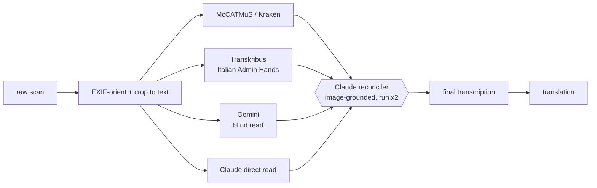

# Archivio Diocesano — Multi-Engine HTR & Translation Pipeline

> Transcribing and translating a photographed early-modern diocesan archive —
> Latin and Italian parish registers and episcopal decrees, **c. 1570–1683** —
> by ensembling several handwriting-recognition engines and reconciling their
> reads against the original image.

Early-modern clerical cursive is hard, and **no single HTR engine is reliable**
on it. Instead of trusting one model, this project runs each page through
multiple independent engines and then uses a vision-capable LLM to reconcile
the candidate transcriptions *against the page image itself*. Where the engines
disagree is exactly where attention is needed — so disagreement becomes a
feature, not a failure.

---

## The archive

359 photographs across seven registers from the Como/Milan area:

| Register | Pages | Date | Language | Notes |
|---|---:|---|---|---|
| Stato delle anime di Turate | 24 | 1679 | Italian | *Status animarum* (census of souls); 12 MP scans |
| X 4 | 109 | 1574 | Italian | phone photos, ~2 MP |
| X 18 | 95 | 1570–79 | Italian | phone photos, ~2 MP |
| X 44 | 65 | 1583 | Italian | phone photos, ~2 MP |
| X 20 | 33 | 1583 | Italian | phone photos, ~2 MP |
| X 5 | 28 | 1642–74 | Latin | episcopal / synodal decrees |
| X 51 | 5 | — | — | undated |

> Source scans are **not committed** to the repository (size + rights). See
> [`.gitignore`](.gitignore); the pipeline reads them from `raw/`.

---

## Why an ensemble

A 2025 study on abbreviated Latin court hand ([arXiv:2507.04132](https://arxiv.org/abs/2507.04132))
showed that feeding an HTR baseline **plus the original image** to an LLM for
multimodal post-correction reaches **2–7% word error rate** — far better than
any single engine. This project generalizes that idea to a small panel of
deliberately *independent* engines (so their errors don't correlate), then
reconciles:



### Engine lineup

| Engine | Role | Why |
|---|---|---|
| **McCATMuS** (Kraken) | local workhorse | covers 16th–21st c., Italian + Latin; free, unlimited, runs on CPU |
| **Transkribus — Italian Administrative Hands 1550–1700** | period/region specialist | trained on Milan/Venice/Florence/Pisa/Genoa archives for parish & tax records; used as a tie-breaker (paid credits) |
| **Gemini** (vision LLM) | decorrelated blind read | different model family from both HTR engines and the reconciler |
| **Claude** | reconciler + 4th reader | reads the image alongside all candidates; run twice to flag uncertainty |

Engines considered and **rejected**: *Tridis v2* (wrong period — 11th–16th c., no
Italian); *TrOCR-f* (strong architecture but no ready 17th-c Italian checkpoint —
kept as a phase-2 fine-tune target).

---

## Pipeline

1. **Manifest** — index every image; record register, resolution, checksum, status.
2. **Preprocess** — apply EXIF orientation and crop each frame to its written
   area (these are open-book photos; much of each frame is blank page or background).
3. **Transcribe** — run each engine; one text file per engine per page.
4. **Reconcile** — Claude merges the candidate reads against the cropped image,
   household block by household block, twice, marking disagreements.
5. **Deduplicate** — on the *transcribed text*, not the image (visually similar
   register pages fool perceptual hashing).
6. **Translate** — render the final transcription into the target language.

### Preprocessing notes (the non-obvious parts)

- **EXIF orientation** — 135 of 359 photos carry a 90° rotation flag that PIL
  ignores by default. Honoring it (`ImageOps.exif_transpose`) was the single
  biggest correctness fix; a third of the archive was silently sideways.
- **Crop to text** — backgrounds are *dark*, paper is *bright*, ink is dark-on-bright,
  so "dark = ink" fails (it catches the background). The crop detects ink as
  pixels darker than their local *bright* surroundings, then bounds the densest
  text block — with a robust threshold so water-stains and ink-blots don't hijack it,
  and a safety floor that keeps the full frame rather than risk clipping text.

---

## Repository layout

```
raw/                         original scans (gitignored)
processed/
  cropped/<page_id>.jpg       EXIF-corrected, cropped-to-text — canonical engine input
  transcriptions/<engine>/    one .txt per page per engine
  translations/
dataset/manifest.csv          the spine: page_id, register, dims, checksum, status
scripts/
  build_manifest.py           index the archive
  crop_pages.py               EXIF-orient + crop to text
  dedupe_audit.py             perceptual near-duplicate audit (cross-check only)
```

Pages are keyed `p001`–`p359` (register-then-filename order) across all stages.

---

## Getting started

Requires Python 3.10+, no GPU needed for inference (CPU is fine).

```bash
python3 -m venv .venv
.venv/bin/pip install kraken 'numpy<2.3' 'scipy==1.15.3' Pillow imagehash
# (numpy must stay <2.3 or scipy's compiled extensions break Kraken's import)

# fetch the McCATMuS recognition model
.venv/bin/kraken get 10.5281/zenodo.13788177

# build the manifest and preprocess
.venv/bin/python3 scripts/build_manifest.py
.venv/bin/python3 scripts/crop_pages.py            # all pages
.venv/bin/python3 scripts/crop_pages.py p001 --preview   # one page + thumbnail

# transcribe one page with McCATMuS
MODEL=$(find ~/.local/share/htrmopo -name 'McCATMuS*.mlmodel' | head -1)
.venv/bin/kraken -i processed/cropped/p001.jpg out.txt segment -bl ocr -m "$MODEL"
```

---

## Status

- [x] Acquire & extract archive
- [x] Manifest + dataset structure
- [x] Preprocessing — EXIF orientation + crop-to-text (robust across all registers)
- [x] McCATMuS installed and proven end-to-end
- [ ] Batch McCATMuS over all pages
- [ ] Transkribus + Gemini passes
- [ ] Image-grounded reconciliation
- [ ] Text-based deduplication
- [ ] Translation

---

## Acknowledgements

Built on [Kraken](https://kraken.re/) and the
[McCATMuS](https://doi.org/10.5281/zenodo.13788177) model, with
[Transkribus](https://www.transkribus.org/) for the period-specific Italian model.
Reconciliation approach informed by
*An HTR-LLM Workflow for High-Accuracy Transcription of Abbreviated Latin Court Hand*
([arXiv:2507.04132](https://arxiv.org/abs/2507.04132), 2025).
