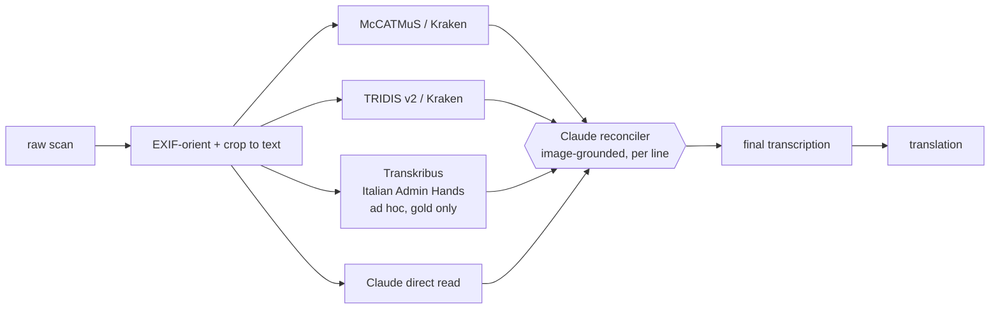

# Archivio Diocesano — Multi-Engine HTR & Translation Pipeline

> Transcribing and translating a photographed early-modern diocesan archive —
> Latin and Italian parish registers and episcopal decrees, **c. 1570–1683** —
> by ensembling several handwriting-recognition engines and reconciling their
> reads against the original image.

Early-modern clerical cursive is hard, and **no single HTR engine is reliable**
on it. Instead of trusting one model, this project runs each page through
multiple independent engines and then uses a vision-capable LLM to reconcile
the candidate transcriptions *against the page image itself*. Where the engines
disagree is exactly where attention is needed — so disagreement becomes a
feature, not a failure.

---

## The archive

359 photographs across seven registers from the Como/Milan area:

| Register | Pages | Date | Language | Notes |
|---|---:|---|---|---|
| Stato delle anime di Turate | 24 | 1679 | Italian | *Status animarum* (census of souls); 12 MP scans |
| X 4 | 109 | 1574 | Italian | phone photos, ~2 MP |
| X 18 | 95 | 1570–79 | Italian | phone photos, ~2 MP |
| X 44 | 65 | 1583 | Italian | phone photos, ~2 MP |
| X 20 | 33 | 1583 | Italian | phone photos, ~2 MP |
| X 5 | 28 | 1642–74 | Latin | episcopal / synodal decrees |
| X 51 | 5 | — | — | undated |

> Source scans are **not committed** to the repository (size + rights). See
> [`.gitignore`](.gitignore); the pipeline reads them from `raw/`.

---

## Why an ensemble

A 2025 study on abbreviated Latin court hand ([arXiv:2507.04132](https://arxiv.org/abs/2507.04132))
showed that feeding an HTR baseline **plus the original image** to an LLM for
multimodal post-correction reaches **2–7% word error rate** — far better than
any single engine. This project generalizes that idea to a small panel of
deliberately *independent* engines (so their errors don't correlate), then
reconciles:



### Engine lineup

| Engine | Role | Why |
|---|---|---|
| **McCATMuS** (Kraken) | local workhorse | covers 16th–21st c., Italian + Latin; free, unlimited, runs on CPU |
| **TRIDIS v2** (Kraken) | second local read | documentary Latin strength — especially the episcopal decrees; free, CPU |
| **Transkribus — Italian Administrative Hands 1550–1700** | period/region specialist | Milan/Venice/Florence/Pisa/Genoa archives; used *ad hoc* to help build gold pages (free tier) |
| **Claude** | reconciler + reader | reads the image alongside all candidates and reconciles per line |

Engines considered and **rejected**: *Gemini / vision-LLM blind transcriber* (on the
only Italian historical HTR benchmark, LLMs hit 20–26% CER and hallucinate — too risky
as a gold candidate); *TrOCR-f* (strong architecture but no ready 17th-c Italian
checkpoint — kept as a phase-2 fine-tune target).

---

## Pipeline

1. **Manifest** — index every image; record register, resolution, checksum, status.
2. **Preprocess** — apply EXIF orientation and crop each frame to its written
   area (these are open-book photos; much of each frame is blank page or background).
3. **Transcribe** — run each engine; one text file per engine per page.
4. **Reconcile** — Claude merges the candidate reads against the cropped image,
   household block by household block, twice, marking disagreements.
5. **Deduplicate** — on the *transcribed text*, not the image (visually similar
   register pages fool perceptual hashing).
6. **Translate** — render the final transcription into the target language.

### Preprocessing notes (the non-obvious parts)

- **EXIF orientation** — 135 of 359 photos carry a 90° rotation flag that PIL
  ignores by default. Honoring it (`ImageOps.exif_transpose`) was the single
  biggest correctness fix; a third of the archive was silently sideways.
- **Crop to text** — backgrounds are *dark*, paper is *bright*, ink is dark-on-bright,
  so "dark = ink" fails (it catches the background). The crop detects ink as
  pixels darker than their local *bright* surroundings, then bounds the densest
  text block — with a robust threshold so water-stains and ink-blots don't hijack it,
  and a safety floor that keeps the full frame rather than risk clipping text.

---

## Repository layout

```
raw/                              original scans (gitignored — large/rights-restricted)
processed/
  cropped/<pid>.jpg               EXIF+spread-split+cropped images (gitignored)
  transcriptions/
    reconciled/<pid>.txt          ★ best transcription per page (+ turate_reconciled.txt)
    mccatmus/  tridis/            raw per-engine output
  translations/<pid>.txt          modern-Italian normalization (+ turate_italiano.txt)
gold/<pid>/ensemble.tsv           per-line candidates (v2|McCATMuS|TRIDIS) + reconciled
gold/models/                      fine-tuned model weights (gitignored), v3_review.tsv
dataset/manifest.csv              photo inventory · pages.csv  page index (383 pages)
scripts/                          full pipeline (crop → ocr → gold → fine-tune →
                                  bootstrap → ensemble → reconcile → normalize)
```

Pages are keyed `p001…p024b` — a photo id, plus an `a`/`b` suffix for the two halves of
an open-book spread — consistent across every stage.

---

## Getting started

Requires Python 3.10+, no GPU needed for inference (CPU is fine).

```bash
python3 -m venv .venv
.venv/bin/pip install kraken 'numpy<2.3' 'scipy==1.15.3' Pillow imagehash
# (numpy must stay <2.3 or scipy's compiled extensions break Kraken's import)

# fetch the McCATMuS recognition model
.venv/bin/kraken get 10.5281/zenodo.13788177

# build the manifest and preprocess
.venv/bin/python3 scripts/build_manifest.py
.venv/bin/python3 scripts/crop_pages.py            # all pages
.venv/bin/python3 scripts/crop_pages.py p001 --preview   # one page + thumbnail

# transcribe one page with McCATMuS
MODEL=$(find ~/.local/share/htrmopo -name 'McCATMuS*.mlmodel' | head -1)
.venv/bin/kraken -i processed/cropped/p001.jpg out.txt segment -bl ocr -m "$MODEL"
```

---

## Status

- [x] Acquire & extract archive (359 photos)
- [x] Manifest + dataset structure
- [x] Preprocessing — EXIF orientation + open-book **spread-splitting** + crop-to-text → **383 pages**
- [x] McCATMuS baseline (local, CPU)
- [x] **Fine-tune + bootstrap loop on Turate (1679)** — v1 → v2 → v3
- [x] **Claude reconciliation of all 46 Turate pages** (image-grounded, register-wide context)
- [x] Draft **modern-Italian normalization** (interpretive edition)
- [ ] Paleographer verification → human-verified gold + true CER
- [ ] v4 + roll out to remaining registers (X4, X18, X20, X44, X5-Latin)
- [ ] Text-based deduplication

### Results so far — Turate 1679 (one scribe, 46 pages)

Validation character-accuracy of the fine-tuned recognizer, each round trained on
progressively better gold (seed → bootstrap-harvest → Claude-reconciled):

| model | training data | val char-acc |
|---|---|---|
| stock McCATMuS | — | ~0.59 |
| v1 | 80 human-seed lines | 0.818 |
| v2 | + 836 bootstrap-harvested lines | 0.856 |
| **v3** | **677 Claude-reconciled lines** | **0.878** |

Outputs: reconciled transcription in `processed/transcriptions/reconciled/` (+ a combined
`turate_reconciled.txt`); draft Italian normalization in `processed/translations/`.

---

## Acknowledgements

Built on [Kraken](https://kraken.re/) and the
[McCATMuS](https://doi.org/10.5281/zenodo.13788177) model, with
[Transkribus](https://www.transkribus.org/) for the period-specific Italian model.
Reconciliation approach informed by
*An HTR-LLM Workflow for High-Accuracy Transcription of Abbreviated Latin Court Hand*
([arXiv:2507.04132](https://arxiv.org/abs/2507.04132), 2025).
