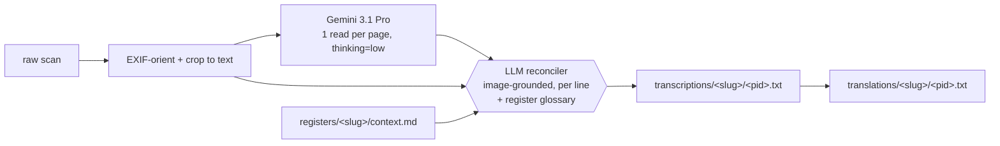

# Archivio Diocesano — HTR & Translation

> Transcribing **and** translating a photographed early-modern diocesan archive — Latin and
> Lombard-Italian parish registers and episcopal/visitation decrees, **c. 1566–1691**, from the
> **Pieve d'Appiano** (parish of **Gerenzano**, in the Como/Milan borderland) — by reading each
> page with a frontier vision-LLM, reconciling that read against the original image, and then
> translating the result into modern Italian.

**Status: complete.** Every one of the **383 pages** now has a semi-diplomatic transcription in
[`transcriptions/`](transcriptions/) and a modern-Italian translation in
[`translations/`](translations/). The two trees mirror each other file-for-file: the same
`<register>/<page>.txt` path gives you the original text on one side and its Italian on the other.

Early-modern clerical cursive is genuinely hard — abbreviated, idiosyncratic, mixing Latin and
Lombard Italian, often on 2-megapixel phone photographs. The production method here is a **single
frontier vision-LLM read per page (Gemini 3.1 Pro), reconciled against the pixels by a second LLM
(Claude)**. The reconciler reads the *image alongside* the candidate transcription, fixes misread
names and numbers using cross-page knowledge, and marks honest uncertainty (`[?]`, `[...]`) rather
than guessing. Grounding every correction in the image is what stops hallucination.

---

## How we got here — and why the obvious approach was wrong

We did **not** start here. The first build was the textbook digital-paleography pipeline: a panel of
local handwriting-recognition engines, ensembled line by line, then fine-tuned per scribe.

- **McCATMuS** and **TRIDIS** (open HTR models, run on [Kraken](https://kraken.re/)) were the two
  voters — both strong on early-modern European book hands, and their disagreements were meant to
  flag the lines a human should check.
- We segmented each page into lines, ran both engines, and merged their output.
- We even **fine-tuned** McCATMuS on a few dozen hand-corrected pages, which lifted validation
  character-accuracy on the Turate scribe to **0.878** (stock McCATMuS managed ~0.59).

On paper, promising. In practice, on *this* material — dense, abbreviated 16th-century cursive
photographed at ~2 MP — the stock engines sat at roughly **40–60 % character error**, and, worse,
they mangled exactly the things that carry the archive's value: the **proper names, the place-names,
and the numbers**. A fine-tune helps one hand at a time, but the archive has several distinct
scribes (the Turate, X-18 and X-5 hands are demonstrably different people), so per-hand tuning is a
treadmill — and a 0.878 character model still fumbles a surname often enough to be untrustworthy for
genealogy or prosopography.

The pivot came from a 2025 result on abbreviated Latin court hand
([arXiv:2507.04132](https://arxiv.org/abs/2507.04132)): feeding an HTR read **plus the original
image** to a multimodal LLM for post-correction reaches **2–7 % word error** — far past any single
engine. We took it one step further. Instead of using the LLM only to *correct* a weak HTR read, we
let a **frontier vision-LLM read the whole page directly**, with the register's glossary in context,
and used a **second LLM to reconcile that read against the same image**, line by line. Reading the
entire page at once gives the model the surrounding context a line-segmented engine never sees — the
neighbouring household, the repeated surname, the running date — and it generalises across hands with
no per-scribe gold or fine-tuning.

That frontier-reader-plus-image-reconciler approach was both **more accurate and more general**, so
the local ensemble was **benched**. Its tooling, fine-tune gold and trained models have been removed
from the working tree to keep this a clean, text-only repository; they remain in the project's git
history if anyone ever wants to revive them for the 12 MP Turate scans. Disagreement is still the
signal that drives quality — it has simply moved from *engine vs. engine* to *read vs. image* and
*read vs. cross-page context*.

---

## The archive

359 photographs across seven registers → **383 pages** after splitting open-book spreads:

| Register (slug) | Pages | Date | Language | Notes |
|---|---:|---|---|---|
| Stato delle anime di Turate (`turate`) | 46 | **1579**\* | Italian | *status animarum* (census of souls); **12 MP** scans |
| X 4 (`x-4-1574`) | 109 | 1574 (docs 1566–1596) | Italian/Latin | Borromeo's 1574 visitation + benefice volume; ~2 MP |
| X 18 (`x-18-1570-79`) | 97 | 1570–79 | Italian/Latin | visitations + bound-in 1604 census; ~2 MP |
| X 44 (`x-44-1583`) | 65 | 1583 | Latin | Taurino's 1583 visitation; ~2 MP |
| X 20 (`x-20-1583`) | 33 | 1583 | Italian/Latin | 1583 visitation/tithe decrees; ~2 MP |
| X 5 (`x-5-1642-74`) | 28 | 1642–74 | Latin | episcopal/synodal decrees + 1662 procuration |
| X 51 (`x-51`) | 5 | — | Italian | undated |

> \* **The Turate census is 1579, not 1679** — a +100-year misreading that had propagated through
> earlier drafts and project metadata. Every birthdate recorded in the register falls between 1562
> and 1579 (the latest is a child *nato 26 gennaio 1579*), a *status animarum* is contemporaneous
> with its latest births, and the header itself reads *«Alli 23 d'agosto 1579»*. Flagged for final
> confirmation against the physical book.

> Source scans are **not committed** (size + rights); the pipeline reads them from `raw/`.

---

## Why a frontier-LLM reader + image-grounded reconciliation



**Two findings shaped the design:**

- **`thinking=low` beats `thinking=high`** for the reader (A/B tested across several dense pages):
  equal accuracy, but *better-calibrated* uncertainty (high is overconfident) and ~5× cheaper. The
  **reconciler**, not the reader's thinking budget, is the quality gate.
- **The image is the tie-breaker, always.** The glossary resolves hard names (it is how *Crivelli*
  and the distinct *Gibelli* family stopped being confused, and how the provost Girolamo Armiraglio
  stopped being read as "Crivellus"), but where glossary and pixels disagree, the pixels win. Census
  ages that are genuinely blank in the margin are left blank — never invented.

---

## Pipeline

1. **Manifest** — index every image (register, resolution, checksum) → `dataset/manifest.csv`.
2. **Preprocess** — EXIF-orient + crop each frame to its written area, splitting open-book spreads →
   cropped images + `dataset/pages.csv`.
3. **Read** — one Gemini-3.1-Pro read per page (`thinking=low`), with the register glossary injected.
4. **Reconcile** — a second LLM merges the read against the cropped image + glossary, line by line,
   fixing names/numbers and marking uncertainty → **`transcriptions/<slug>/<pid>.txt`**.
5. **Translate** — render each reconciled transcription into modern Italian →
   **`translations/<slug>/<pid>.txt`** (Latin and Lombard Italian both handled; censuses kept
   line-per-entry, decrees as prose; surnames, dates and amounts preserved).

The reader+reconcile loop ran unattended on an hourly cron; see [`pipeline/`](pipeline/).

### Preprocessing notes (the non-obvious parts that cost real debugging)

- **EXIF orientation** — 135 of 359 photos carry a 90° rotation flag PIL ignores by default. Honoring
  it (`ImageOps.exif_transpose`) was the single biggest correctness fix: a third of the archive was
  silently sideways.
- **Crop to text** — backgrounds are *dark*, paper *bright*, ink dark-on-bright, so "dark = ink"
  fails (it catches the background). The crop detects ink as pixels darker than their *local* bright
  surroundings, then bounds the densest text block, with a safety floor that keeps the full frame
  rather than risk clipping text.

---

## Repository layout

```
transcriptions/<slug>/<pid>.txt     ★ semi-diplomatic transcription per page (THE deliverable)
  _REVIEW_QUEUE.txt                  pages/spots flagged for a human paleographer pass
  turate/reconciled_combined.txt     all Turate census pages stitched into one file
translations/<slug>/<pid>.txt        ★ modern-Italian translation per page (THE deliverable)
  turate/italiano_combined.txt       all Turate census pages, in Italian, in one file
registers/<slug>/context.md          per-register glossary (people, places, families) used in every read
pipeline/                            the live pipeline: Gemini read + reconcile (gemini_htr.py, config.json)
scripts/                             preprocessing: build_manifest.py, crop_pages.py, paths.py
dataset/manifest.csv, pages.csv      photo inventory (359 photos) + page index (383 pages)
raw/, processed/                     scans + regenerable working area (gitignored, not in this repo)
```

Pages are keyed `p001…p359`; an `a`/`b` suffix marks the two halves of an open-book spread.

**Conventions.** Transcriptions are *semi-diplomatic*: the scribe's spelling and abbreviations are
kept, expansions go in `[brackets]` (`p[er]`, `q[uon]d[am]`), `[?]` marks one uncertain word and
`[...]` an illegible run — never filled with a guess. Marginalia, folio numbers and second hands are
noted in `[ ]`, not transcribed as text. Translations modernise spelling and expand abbreviations
while keeping every surname, place-name, date and amount, and carry the same `[?]` / `[...]`
uncertainty markers forward.

---

## Getting started (to reproduce or extend)

Python 3.10+, no GPU. Put a Gemini API key outside the repo (e.g. `~/.config/gemini.key`) and point
`pipeline/config.json` at it.

```bash
python3 -m venv .venv
.venv/bin/pip install google-genai Pillow

.venv/bin/python3 scripts/build_manifest.py            # index the photos
.venv/bin/python3 scripts/crop_pages.py                # EXIF + spread-split + crop

# read a register with Gemini (resumable; skips pages already done)
PYTHONPATH=scripts .venv/bin/python3 pipeline/gemini_htr.py run x-4-1574
PYTHONPATH=scripts .venv/bin/python3 pipeline/gemini_htr.py status
```

The reconciliation and translation passes are LLM-in-the-loop against the cropped images.

---

## Status

- [x] Acquire & extract the archive (359 photos)
- [x] Manifest + page index (383 pages)
- [x] Preprocessing — EXIF + open-book **spread-splitting** + crop-to-text
- [x] Production pipeline: **Gemini 3.1 Pro read + image-grounded LLM reconciliation**
- [x] **Transcription — 383/383 pages** → [`transcriptions/`](transcriptions/)
- [x] **Translation — 383/383 pages into Italian** → [`translations/`](translations/)
- [ ] Human paleographer spot-check of [`transcriptions/_REVIEW_QUEUE.txt`](transcriptions/_REVIEW_QUEUE.txt) → verified gold + true error rate
- [ ] Text-based deduplication of visually-similar register pages
- [ ] Confirm the Turate **1579** date against the physical book

> **Caveat for anyone building on this:** the translations are only as reliable as the underlying
> transcriptions, and the ~2 MP X-folder hands leave many readings uncertain. Names and places marked
> `[?]` are provisional and should be checked against the images before being used for genealogical
> or prosopographical work. The `_REVIEW_QUEUE` collects the specific contested names, ages and dates.

---

## Acknowledgements

Reading by [Gemini 3.1 Pro](https://ai.google.dev/); reconciliation and translation by Claude.
Preprocessing built on [Pillow](https://python-pillow.org/). The earlier (benched) local-engine
ensemble used [Kraken](https://kraken.re/) with the
[McCATMuS](https://doi.org/10.5281/zenodo.13788177) and TRIDIS models. Reconciliation approach
informed by *An HTR-LLM Workflow for High-Accuracy Transcription of Abbreviated Latin Court Hand*
([arXiv:2507.04132](https://arxiv.org/abs/2507.04132), 2025).
